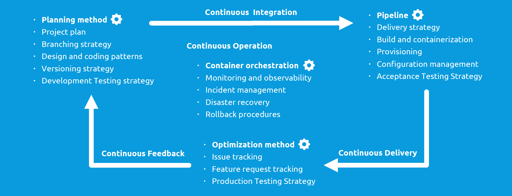

# DevOps Project Template

*[CC-NC-SA-BY 4.0](https://creativecommons.org/licenses/by-nc-sa/4.0/legalcode) By Patrick Savalle*

> ## Clone this repo and use it to setup, review or document your own project configuration 
> - [x] Review and check all the items

> Contents:
>
> - [Checklist](#checklist)
> - [Tips and hints](#tips-and-hints)
> - [Fundamentals](#fundamentals)

DevOps is an [iterative and incremental](#iterations-and-increments) software development approach with emphasis on *autonomy*, *automation*, *continuous
improvement* and *collaboration* (loose definition).

## Checklist

### General

- [ ] [Project plan](content/project-plan.md)
- [ ] [Tooling](content/tools.md)

### Continuous Integration 

- [ ] [Planning method](content/planning-method.md) 
- [ ] [Branching strategy](content/branching-strategy.md)
- [ ] [Design guidelines](content/design-guidelines.md)
- [ ] [Coding guidelines](content/coding-guidelines.md)
- [ ] [Versioning strategy](content/versioning-strategy.md)
- [ ] [Developer Testing strategy](content/developer-testing-strategy.md)

### Continuous Delivery 

- [ ] [Pipeline setup](content/pipeline-setup.md)
- [ ] [Delivery strategy](content/delivery-strategy.md)
- [ ] [Provisioning and configuration](content/provisioning-configuration.md)
- [ ] [Acceptance Testing strategy](content/acceptance-testing-strategy.md)

### Continuous Feedback 

- [ ] [Optimization method](content/optimization-method.md)
- [ ] [Production Testing strategy](content/production-testing-strategy.md)
- [ ] [Feature request and issue tracking](content/feature-request-issue-tracking.md)

### Continuous Operation 

- [ ] [Ops Strategy](content/operations-setup.md)
- [ ] [Monitoring and Observability Strategy](content/monitoring-strategy.md)
- [ ] [Incident management procedure](content/incident-management-procedure.md)
- [ ] [Rollback procedure](content/rollback-strategy.md)
- [ ] [Disaster recovery procedure](content/disaster-recovery-procedure.md)

### Standards & Guidelines

- [ ] [API standard](content/api-standard.md)
- [ ] [Integration guidelines](content/integration-standard.md)
- [ ] [Security guidelines](content/security-guidelines.md)

See: 
- [continuousdelivery.com](https://continuousdelivery.com/)

## Tips and hints
See: [DevOps and software quality: A systematic mapping](https://www.sciencedirect.com/science/article/pii/S1574013720304081)

- [ ] Adopt [LSD/LEAN](content/lsd-lean.md) as your general (agile) philosophy, DevOps is [principle 5](https://railsware.com/blog/lean-software-development-guide/#Principle_5_Fast_delivery).

- [ ] Never go dark, never assume, communicate with appropriate [stakeholders](content/project-plan.md#stakeholders) in all phases of the project

- [ ] Do not plan the ideal system, design for immediate value and changeability, and evolve

- [ ] [Plan](content/planning-method.md) minimal valuable increments and measure their success before progressing upon them

- [ ] Enable projects to function autonomously and self-organising (self-service, architecture, governance)

- [ ] [Plan](content/planning-method.md) in ever shorter increments and [optimize](content/optimization-method.md) in ever shorter iterations until everything is continuous

- [ ] Continuously remove [sub-optimality and waste](content/optimization-method.md)

- [ ] Include end-users in the learning loop as soon as possible but no later than the [MVP](content/project-plan.md#minimum-viable-product)

- [ ] Make collaboration as [scalable](#scalable-collaboration) as (security-wise) possible

- [ ] Everything is code

- [ ] Everything is automated

- [ ] Everything is tested

## Fundamentals

### Modularity

Systems are made up of interconnected **subsystems** (partitions or parts), this is called **modularity**.
Parts have natural **low coupling** externally and **high cohesion** internally.

A selection of the system based on functionality present across multiple subsystems is called an **aspectsystem** or (aspect).

> Examples:
> - the rooms of a house are subsystems, the electrical wiring and the plumbing of a house are aspectsystems
> - the RGB-pixels of a display are subsystems or parts, all red pixels of the display form an aspectsystem

#### Dependency graph

Parts of modular systems have a natural mutual order visualized by a directed graph.
This dependency graph visualizes how changes propagate and what is the most efficient
order in which to build the system. 
To determine this order:
1. Modules with no outgoing dependencies have layer 0
2. A module's layer number is the longest path to layer 0
3. Modules that have mutual / cyclic dependencies are on the same layer
4. The system must be build in ascending order of layers

The Modularity Principle states that programs should be built from cohesive, loosely coupled modules in order of their
dependencies. Modules translate to increments in the [planning](content/planning-method.md). 

### Iterations and increments

Workflows are made up of increments that sequentially add new parts or aspects and iterations that repetitively improve
existing parts or aspects. Increments generally make systems more complete based on feed-forward (design), iterations generally make it more perfect based on
feed-back (bug reports, performance issues, enz.).

### Complexity

Complexity is roughly the result of quantity, diversity and coupling. it can be managed with:

- Divide-and-conquer
- White-box / blackbox strategy
- Encapsulation
- Patterns or symmetry (reducing diversity)
- Abstraction 

### Functionals vs. Non-functionals

Functionals are the system properties that the end-user interacts with to perform tasks.

Non-functionals are the properties that give a system reliability, security, scalability, robustness, maintainability
and changeability.

### Refactoring

Changing a system’s **modularity** without changing its **functionality** is called refactoring.

Reasons to refactor a system include:

- accommodate large changes in requirements
- making parts of it reusable in other systems and improving changeability
- restoring drift from ideal functional modularity caused by agile (design-less) project planning

### Encapsulation and Interfaces

To make (implementation) complexity manageable it needs to be hidden, encapsulated by an interface. Users only need to see the (
simple) interface, not the (complex) implementation.

A good interface is:

- Minimal
- Complete
- Opaque (it hides implementation details)
- Self-explanatory
- Consistent
- Documented

### Scalable collaboration

Development collaboration in DevOps is done using a task board.
Scalable collaboration means stories and tasks on the board can be crowd-sourced, beyond the teams.
To make this collaboration scalable (distributable):
- tasks must be isolated, without too much context
- tasks must be small, to stay mergible back into the collective
- tasks must be unassigned, so that anyone can collaborate
- tasks must be independent, so many can be done in parallel
- tasks must be on some kind of open marketplace / platform
- only simple rules are needed to collaborate
- no direct (same time, same place) communication is necessary

> Some examples: both Git and Kanban are scalable. Scrum is not. Bug fixing is scalable, feature coding much less so. Etc.
Good design helps scalability of collaboration.

See [stigmergic collaboration](https://medium.com/@patricksavalle/designing-distributed-scalable-collaboration-9c6aabd5777e) for some theory.

