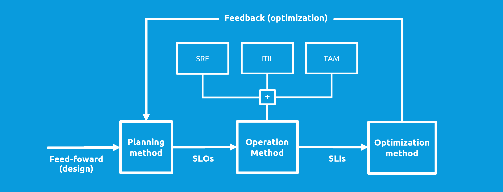

# Operation Method

Operations manages how code is deployed, configured, and monitored, as well as the availability, latency, change management, emergency response, and capacity management of services in production.

```
Clone this repo and document your specific choice here:


```

``
> Content
> - [Tips and hints](#tips-and-hints)
> - [SRE pinciples](#sre-principles)
> - [TAM](#tam)
> - [ITIL](#ITIL)



See:
- [SRE Practices Without SREs](https://sre.google/workbook/team-lifecycles/)
- [Do you have an SRE team yet? How to start and assess your journey](https://cloud.google.com/blog/products/devops-sre/how-to-start-and-assess-your-sre-journey)
- [The Site Reliability Workbook: Practical Ways to Implement SRE](https://www.pdfdrive.com/the-site-reliability-workbook-practical-ways-to-implement-sre-e176435365.html)
- [Site Reliability Engineering: How Google Runs Production Systems](https://www.pdfdrive.com/site-reliability-engineering-how-google-runs-production-systems-e167267360.html)


## Tips and hints

- [ ] Use [SRE](https://www.redhat.com/en/topics/devops/what-is-sre) as a basis


- [ ] Define reasonable SLOs (service level objectives)


- [ ] Have a [monitoring strategy](monitoring-strategy.md) implemented and measure the SLIs (service level indicators)


- [ ] Have a [rollback strategy](rollback-strategy.md) implemented


- [ ] Have an [incident management procedure](incident-management-procedure.md) in place


- [ ] Create a culture of authoring [blameless postmortems](https://sre.google/workbook/postmortem-culture/)


- [ ] As a start, have normal development teams assign SRE-engineers that spend 50% of their time in a specialized horizontal SRE-team


## SRE principles

> Principle #1:
SRE needs SLOs with consequences.

> Principle #2:
SREs must have time to make tomorrow better than today.
 
> Principle #3:
SRE teams have the ability to regulate their workload.

## ITIL


##  TAM 

Technical application management is the more traditional way of doing operation.
The TAM engineer is traditionally focused on execution and not on prevention, which is also part of SRE.