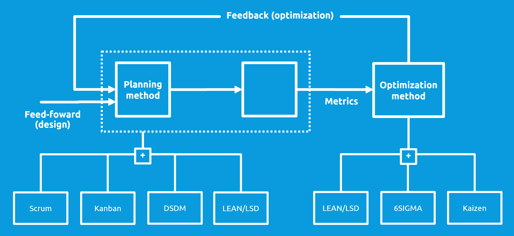

# Optimization Method

```
Clone this repo and document your optimization method here:


```
> Content
> - [Tips and hints](#tips-and-hints)
> - [LEAN](#lsd-lean)
> - [Kaizen](#kaizen)
> - [6Sigma](#six-sigma-dmaic)



Optimization is an iterative process based on feedback or learning loops.
An optimization method determines the  *iterations* of the project. 
DevOps is compatible with many optimization methods. 
Often hybrid methods will work best, cherry-picking elements from multiple methods. 

Optimizations include:
- Refactorings to improve modularity or remove weak design
- Improving performance and resource usage
- Improving UX and functionality
- Removing slack, engineering debt or TODO's

Optimization starts with detecting sub-optimality or waste.

[Incident management](incident-management-procedure.md) is not optimization: optimizations are fed back to the planning process whereas incidents are handled immediately.

## Tips and hints

- [ ] Implement [LSD](#lsd-lean) (LEAN) as optimization method before the [MVP](project-plan.md#minimum-viable-product) is released 


- [ ] Explicitly define [optimality](#optimality), make sub-optimality measurable


- [ ] optimize only what can be measured (monitored)


- [ ] Continuously identify **and** backlog sub-optimality in periodic optimization ceremonies


- [ ] Distinguish between waste / sub-optimality in the DevOps process itself and in the user's processes as facilitated by the product


- [ ] Build for observability (logging, tracing, monitoring)


- [ ] Build for [production-testing](production-testing-strategy.md) (fault injection, chaos engineering)


## Optimality

To be able to optimize, optimality must be defined (quantified) and continuously measured. Use metrics for this.

[TODO] 

## LSD (LEAN)

Lean software development is a translation of lean manufacturing principles and practices to the software development domain.
Part of Lean is to continuously eliminate waste.
The original Lean (TPS) recognized 3 types of waste

- **Muda** : waste, uselessness, non-value added or idleness
- **Muri** : overburden, impossible, beyond one’s power excessiveness.
- **Mura** : unevenness, irregularity or lack of uniformity.

### Types of waste

Waste elimination is defined as the removal of anything that fails to add value to your development process and/or the final product. Here are the seven types of waste identified by LSD:

- **Software defects.** Prevent bugs from being introduced in the first place.


- **Hand-offs.** Passing the work from one specialist, team, or department to another causes pauses and delays. 


- **Waiting/Delays.** When a development team member isn't able to move forward on the highest priority task.


- **Task switching.** This waste occurs when developers need to jump from one context to another. 


- **Repetitive processing of the same information, or re-learning.** This happens when a team doesn’t have an effective knowledge-sharing approach and poorly documents its decisions.


- **Extra or unnecessary features.** These are features that don’t solve a customer issue, or generally have low priority. 


- **Incomplete or partially completed work.** There are many examples of this type of waste: unfinished/partially developed but never released features; hours spent in meetings without any actionable steps defined; bugs that are defined and discussed, but never fixed; a completed design for a full-featured module that is only partially implemented.


See: [Key principles of Lean Software Development methodology](https://railsware.com/blog/lean-software-development-guide/)

## Kaizen

Kaizen is a concept referring to business activities that continuously improve all functions and involve all employees from the CEO to the assembly line workers.

1. Good processes bring good results
2. Go see for yourself to grasp the current situation
3. Speak with data, manage by facts
4. Take action to contain and correct root causes of problems
5. Work as a team
6. Kaizen is everybody’s business
7. Make small changes over time

## Six Sigma (DMAIC)

1. Define
2. Measure
3. Analyse
4. Improve
5. Control

## ITIL


