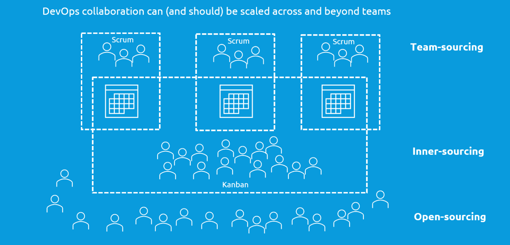

# Planning method

```
Clone this repo and document your planning method here:


```
> Content
> - [Best practices](#best-practices)
> - [Scalable collaboration](#scalable-collaboration)
> - [Waterfall](#waterfall)
> - [Scrum](#scrum)
> - [Kanban](#kanban)
> - [DSDM](#dsdm)
> - [LEAN startup](#lean-start-up)

The planning method determines the content and order of increments. DevOps is compatible with many agile project planning (incremental) methods. Often a hybrid approach will work best,
cherry-picking elements from different methods, like ScrumBan. 

## Best Practices

- [ ] Scrum is a good default 
  - **if** the application has obvious natural increments (e.g. the screens of UI's or endpoints of API's) or a functional design is available (see [Project Plan](project-plan.md)) 
  - **and** a backlog of user-stories is available or an external process for requirements engineering is in place
  

- [ ] Progressively move to Scrumban en ultimately [Kanban](#kanban) (team-less crowdsourcing) as functionality stabilizes


- [ ] Include an architect in the team, certainly if he can also be the DevOps coach


- [ ] Allocate 50% of project time to non-functionals, optimization and DevOps maintenance


- [ ] Open-source as much as (security-wise) possible to allow [scaling](../README.md#best-practices) your collaboration


### Scalable collaboration

To make collaboration scalable (distribuable):
- tasks must be isolated, without too much context
- tasks must be small enough, to stay mergible back into the collective
- tasks must be unassigned, so that anyone can collaborate
- tasks must be independent, so many can be done in parallel
- tasks must be on some kind of open marketplace / platform
- only simple rules are needed to collaborate
- no direct (same time, same place) communication is necessary

> Some examples: both Git and Kanban are scalable. Scrum is not. Bug fixing is scalable, feature coding much less so. Etc.
Good design helps scalability of collaboration.



See [stigmergic collaboration](https://medium.com/@patricksavalle/designing-distributed-scalable-collaboration-9c6aabd5777e) for some theory.

## Waterfall

Waterfall projects have the classic planning increments:
- Requirements engineering
- Functional design and architecture
- Technical and solution design
- Implementation (coding)
- Testing
- Maintenance

## Scrum

This method works with a product backlog of stories that are planned into sprints of typical 2 weeks during refinements.
The team consists of a product-owner, a process-owner (Scrum master) and developers. Often a solution-architect is a
valuable addition.

Requirements Engineering, Functional design ans architecture are done before or outside the actual Scrum process and result in a product backlog.
Without a functional design a much higher refactoring load can be expected as correct modularity needs to be discovered and corrected on the fly.

> General purpose method that is a good choice for:
> - Teams of up to 10 persons
> - Medium size, trivial / conventional applications that don't need extensive design
> - Applications that have natural increments / modularity like web applications and REST-API's
> - Scrum is not suited for maintenance-dominant projects or operations / incident-management, 
once the functionality stabilizes, Kanban is a better choice

## Kanban

This is the simplest but most scalable method. Especially suited for ad hoc, isolated tasks that need
to be open-sourced. Kanban has no specific roles or team composition.

> General purpose, scalable method that is a good choice for:
> - bug fixing
> - maintain and evolving existing applications
> - microtasking
> - open source collaboration of up to thousands of collaborators

## DSDM

This method is a best-effort, fixed time and price approach. It uses time-boxes based on MOSCOW prioritization of
features to be able to deliver as much functionality as possible.
Uses modeling, prototyping and workshops to define the product.

> Method that is a good choice for
>  - cost or time-limited projects with higher degree of uncertainty
>  - projects that can be developed in close collaboration with business and users

## LEAN Start-Up

This method is especially well suited for developing applications that are based on new, unproven functionality, technology and/or concepts.
Key in LEAN startup is validating the riskiest assumptions as soon and cheap as possible. Every decision is based on representative proof.

In general the development progresses from POC's to prototypes to a MVP.


