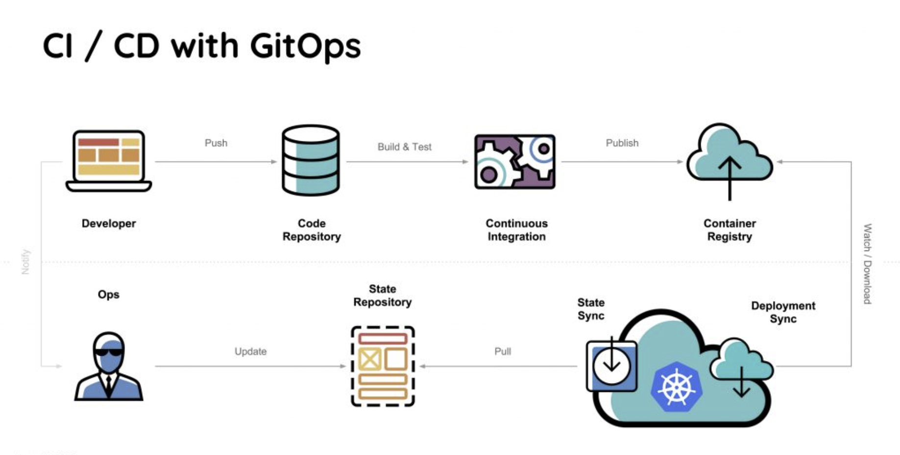

# Provisioning and configuration Management

Provisioning is setting up the infrastructure.
Configuration management is a establishing and maintaining the system in a desired, consistent state.

```
Clone this repo and document your configuration management here:


```
> Content
> - [Tips and hints](#tips-and-hints)
> - [GitOps](#gitops)


## Tips and hints

- [ ] Do GitOps


- [ ] Start small


- [ ] Have a single source of truth


- [ ] Two repos: one for app source code, another for manifests


- [ ] Choose the right number of deployment config repos
  - A mono-repo for a small company with little automation and where you trust everyone
  - A repo per team for a mid-sized company with some automation
  - A repo per service for a large company with plenty of automation and a need for control


- [ ] Choose deployment / delivery by either SRE or teams


- [ ] Test manifest before committing


- [ ] Manifests should not change due to external changes


- [ ] Plan how you’ll manage secrets


## GitOps



GitOps is a way to automate application delivery.
GitOps works by using Git as a single source of truth for declarative infrastructure and applications.
It applies CI/CD (Continuous Integration/ Continuous Delivery) principles to configuration management.
The 4 basic principles of GitOps are:

- System definitions are described as code
- The desired system state and configuration is defined and versioned in Git
- Changes to the configuration can be automatically applied using pull requests
- A controller ensures that no configuration drifts are present

see: 
- [Comparing GitOps implementation patterns](https://www.redhat.com/architect/gitops-implementation-patterns)
- [GitOps: Best practices for the real world](https://developer.ibm.com/blogs/gitops-best-practices-for-the-real-world/)

### CI/CD controller pattern

**(A.k.a. Pull deployment)**

In the CI/CD Controller pattern, an independent application or service is aware of the state of one or many source code repositories. 
It executes a CI/CD deployment automatically when code changes within a particular repository.

### SCM controller pattern

**(A.k.a. Push deployment)**

In the SCM Controller pattern, source code that controls CI/CD deployment activity is colocated in the same Git repository as the application source code. 
Under the SCM Controller, the SCM service can internally execute actions such as builds, tests, and the eventual release to a staging or production target.


## Deployment platform

## VPS


## Docker


## Kubernetes


## Cloud-native

